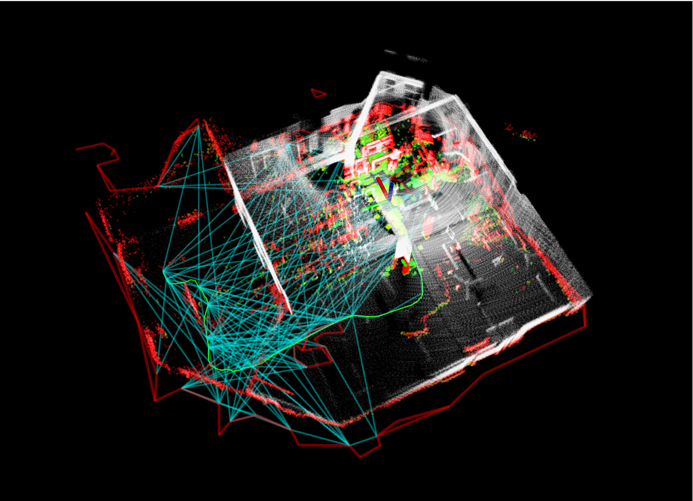

<p align="center">
  
</p># Far Planner Test - Source Directory

This directory contains the complete Far Planner autonomous navigation system with integrated components.

## Project Structure

```
far_planner_workspace/
├── README.md              # Project documentation
├── docs/                  # Documentation and resources
│   ├── images/           # Project images and diagrams
│   ├── setup/            # Setup and installation guides
│   └── api/              # API documentation
├── scripts/              # Utility and launch scripts
│   ├── launch.sh         # Main pipeline launch script
│   ├── setup.sh          # Environment setup script
│   └── build.sh          # Build automation script
├── config/               # Global configuration files
├── tools/                # Development and utility tools
└── workspaces/           # ROS2 workspaces
    ├── autonomous_exploration/  # Autonomous exploration framework
    ├── far_planner/            # Core FAR planner implementation  
    └── pipeline_launcher/      # System orchestration
```

### Workspace Components:

#### 1. `workspaces/autonomous_exploration/`

- **What it is:** The mid-layer autonomous exploration & mapping framework.
  - Modules: **LOAM interface**, **local planner**, **terrain analysis**, **vehicle simulation**, **sensor-scan generation**, and RViz visualization tools.
  - **Not included:** ❗️**No state estimator** here. This package does **not** compute odometry/SLAM by itself.

- **How odometry is obtained**
  - **Simulation (garage world):** The `vehicle_simulator` node acts as an oracle and publishes:
    - `/state_estimation` (`nav_msgs/Odometry`, frame: `map → sensor`) at high rate
    - `/registered_scan` (`sensor_msgs/PointCloud2`, already in `map`) at scan rate
    - matching `/tf` transforms
    - ➜ RViz (Fixed Frame = `map`) shows data immediately; no SLAM required.
  - **Real robot / bag playback:** You must run an external **LIO/LOAM state estimator** (e.g., FAST-LIO2, LIO-SAM, LOAM-Livox). This repo’s **`loam_interface`** then **adapts** the estimator outputs into the topics the stack expects.
    - Expected estimator outputs (examples):
      - Odometry in `map`: `/Odometry` or `/lio_sam/mapping/odometry` (`nav_msgs/Odometry`)
      - Registered cloud in `map`: `/cloud_registered` or `/lio_sam/mapping/cloud_registered` (`PointCloud2`)
    - `loam_interface` republishes them as:
      - `/state_estimation` (odom in `map`)
      - `/registered_scan` (cloud in `map`)
      - and consistent `/tf`
    - ⚠️ `loam_interface` **does not** compute odometry from raw LiDAR; it only **bridges/renames** topics and fixes frame conventions.

- **Key topics & frames**
  - **Inputs (real robot):** estimator odom (`map → sensor`), estimator registered cloud (`map`)
  - **Core outputs:** `/state_estimation`, `/registered_scan`, `/tf`
  - **Frames:** global `map`; sensor frame typically `sensor` (or your LiDAR frame, e.g., `livox_frame`); an auxiliary `sensor_at_scan` may be used for scan-aligned outputs.
  - **RViz:** Fixed Frame must be `map`.

- **Configuration (`loam_interface`)**
  - Set these params to match your estimator:
    ```yaml
    stateEstimationTopic: /Odometry                      # or /lio_sam/mapping/odometry
    registeredScanTopic:  /cloud_registered              # or /lio_sam/mapping/cloud_registered
    mapFrame:             map
    sensorFrame:          livox_frame                    # change to your actual sensor frame
    # flip/reverse flags are available if axes appear inverted
    ```
  - Avoid TF conflicts: if your estimator also publishes a `map → sensor` TF with identical names, don’t double-publish.

- **Typical launches**
  - **Simulation (garage):**
    ```bash
    ros2 launch vehicle_simulator system_garage.launch.py
    ```
  - **Real robot (mid-layer only):**
    ```bash
    ros2 launch vehicle_simulator system_real_robot.launch.py
    # In parallel: run your LIO/LOAM estimator that subscribes to your LiDAR (+IMU) and publishes odom + registered cloud
    ```
  - **Bag playback tips:** use sim time and clock
    ```bash
    ros2 param set /rviz2 use_sim_time true
    ros2 bag play your.bag --clock
    ```

- **Sensor scan generation**
  - Provides scan-timestamped versions of the data:
    - `/sensor_scan` (PointCloud2 in `sensor_at_scan`)
    - `/state_estimation_at_scan` (odom `map → sensor_at_scan`)
    - matching `/tf`

- **Troubleshooting (RViz blank)**
  - Check that `/state_estimation` and `/registered_scan` are publishing (`ros2 topic hz ...`).
  - Verify a live TF chain `map → … → <sensor frame>` (`ros2 run tf2_tools view_frames`).
  - For raw LiDAR preview only, add a PointCloud2 display for your raw topic and set RViz QoS to **Reliable/Volatile**; note this is **not** used by the planner without odom + registration.


#### 2. `workspaces/far_planner/`
- Core FAR (Fast, Attemptable Route Planner for Navigation in Known and Unknown Environments) planner implementation
- Includes boundary handling, graph decoding, and visibility graph processing
- Contains RViz plugins for goal point selection and teleop control

- **What it is:** Core **FAR (Fast & Assured Reachability)** **global planner**.
  - Algorithms: boundary handling, graph decoding, visibility-graph–style planning.
  - Tooling: RViz plugins for **goal selection** and **teleop** to quickly test paths.

- **Inputs (expected)**
  - A **global frame** (usually `map`) with a consistent TF tree.
  - An **obstacle/traversability representation** (from terrain analysis or your mapping stack).
  - A **goal** (from the RViz goal plugin or a topic).
  - The robot’s **current pose** (through TF / odometry).

- **Outputs**
  - A **global path** (e.g., `nav_msgs/Path`) and associated planner markers for RViz.
  - Optional intermediate **waypoints** depending on config.

---

##### Configuration (real robot vs. simulation)

When running on a **real robot**, update this YAML to match your stack (frames, topics, robot size, map source). 


#### 3. `workspaces/pipeline_launcher/`
- Orchestrates the complete system launch sequence
- Coordinates timing between fast_lio mapping, vehicle simulation, and far_planner
- Provides unified launch interface for the entire pipeline

## Quick Start

### Prerequisites
- ROS2 Humble
- All dependencies built and installed

### Method 1: Using the Launch Script (Recommended)
```bash
# Run the automated launch script
./scripts/launch.sh
```

This script will:
1. Source all required setup files
2. Launch the complete pipeline with proper timing
3. Display progress information

### Method 2: Manual Launch
```bash
# Source all required setup files
source ~/Documents/Far_planner_test/workspaces/autonomous_exploration/install/setup.sh
source ~/Documents/Far_planner_test/workspaces/far_planner/install/setup.sh
source ~/Documents/Far_planner_test/workspaces/pipeline_launcher/install/setup.sh

# Launch the pipeline
ros2 launch pipeline_launcher pipeline.launch.py
```

## Launch Sequence

The pipeline launches components in the following order:
1. **T=0s**: `fast_lio` mapping starts (mapping_mid360.launch.py)
2. **T=3s**: `vehicle_simulator` starts (system_real_robot.launch)
3. **T=6s**: `far_planner` starts (far_planner.launch)

Each component has a 3-second delay to ensure proper initialization.

## Alternative Launch

If you encounter issues with the main launch file, try the alternative:
```bash
ros2 launch pipeline_launcher pipeline_alternative.launch.py
```

## Building from Source

If you need to rebuild any component:

```bash
# Build autonomous exploration workspace
cd workspaces/autonomous_exploration
colcon build --symlink-install --cmake-args -DCMAKE_BUILD_TYPE=Release
source install/setup.sh

# Build far planner workspace
cd ../far_planner  
colcon build --symlink-install --cmake-args -DCMAKE_BUILD_TYPE=Release
source install/setup.sh

# Build pipeline launcher workspace
cd ../pipeline_launcher
colcon build
source install/setup.sh
```

## Troubleshooting

- Ensure all ROS2 dependencies are installed
- Check that all packages built successfully without errors
- Verify that your ROS2 environment is properly configured
- If launch fails, try the alternative launch file
- Check ROS2 logs for detailed error information

## Package Dependencies

The system requires these main packages:
- `fast_lio` - Real-time LiDAR-Inertial Odometry
- `vehicle_simulator` - Robot simulation framework
- `far_planner` - Path planning algorithm
- Various support packages for visualization and control
