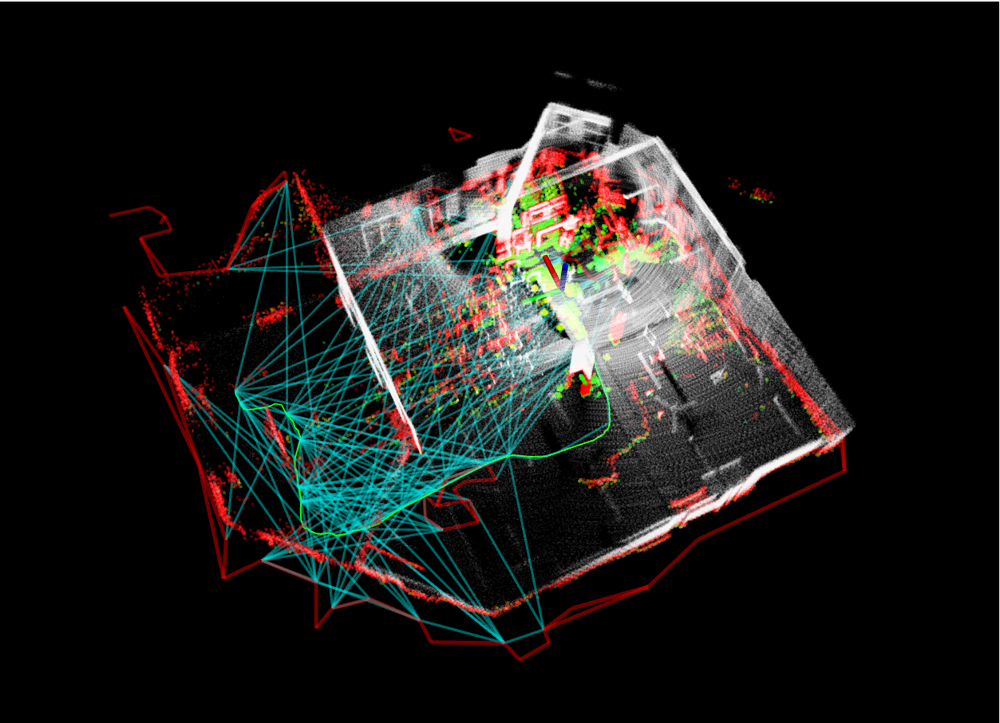

<p align="center">
	
</p>

# Far Planner Test - Source Directory

This directory contains the complete Far Planner autonomous navigation system with integrated components.

## Project Structure

The workspace consists of three main components:

### 1. `autonomous_exploration_development_environment/`
- Contains the autonomous exploration and mapping framework
- Includes LOAM interface, local planner, terrain analysis, and vehicle simulation
- Provides sensor scan generation and visualization tools

### 2. `far_planner/`
- Core FAR (Fast and Assured Reachability) planner implementation
- Includes boundary handling, graph decoding, and visibility graph processing
- Contains RViz plugins for goal point selection and teleop control

### 3. `pipeline_launch/`
- Orchestrates the complete system launch sequence
- Coordinates timing between fast_lio mapping, vehicle simulation, and far_planner
- Provides unified launch interface for the entire pipeline

## Quick Start

### Prerequisites
- ROS2 Humble
- All dependencies built and installed

### Method 1: Using the Launch Script (Recommended)
```bash
# Run the automated launch script
./launch_pipeline.sh
```

This script will:
1. Source all required setup files
2. Launch the complete pipeline with proper timing
3. Display progress information

### Method 2: Manual Launch
```bash
# Source all required setup files
source ~/Documents/Far_planner_test/autonomous_exploration_development_environment/install/setup.sh
source ~/Documents/Far_planner_test/far_planner/install/setup.sh
source ~/Documents/Far_planner_test/pipeline_launch/install/setup.sh

# Launch the pipeline
ros2 launch pipeline_launcher pipeline.launch.py
```

## Launch Sequence

The pipeline launches components in the following order:
1. **T=0s**: `fast_lio` mapping starts (mapping_mid360.launch.py)
2. **T=3s**: `vehicle_simulator` starts (system_real_robot.launch)
3. **T=6s**: `far_planner` starts (far_planner.launch)

Each component has a 3-second delay to ensure proper initialization.

## Alternative Launch

If you encounter issues with the main launch file, try the alternative:
```bash
ros2 launch pipeline_launcher pipeline_alternative.launch.py
```

## Building from Source

If you need to rebuild any component:

```bash
# Build autonomous exploration environment
cd autonomous_exploration_development_environment
colcon build
source install/setup.sh

# Build far planner
cd ../far_planner  
colcon build
source install/setup.sh

# Build pipeline launcher
cd ../pipeline_launch
colcon build
source install/setup.sh
```

## Troubleshooting

- Ensure all ROS2 dependencies are installed
- Check that all packages built successfully without errors
- Verify that your ROS2 environment is properly configured
- If launch fails, try the alternative launch file
- Check ROS2 logs for detailed error information

## Package Dependencies

The system requires these main packages:
- `fast_lio` - Real-time LiDAR-Inertial Odometry
- `vehicle_simulator` - Robot simulation framework
- `far_planner` - Path planning algorithm
- Various support packages for visualization and control
