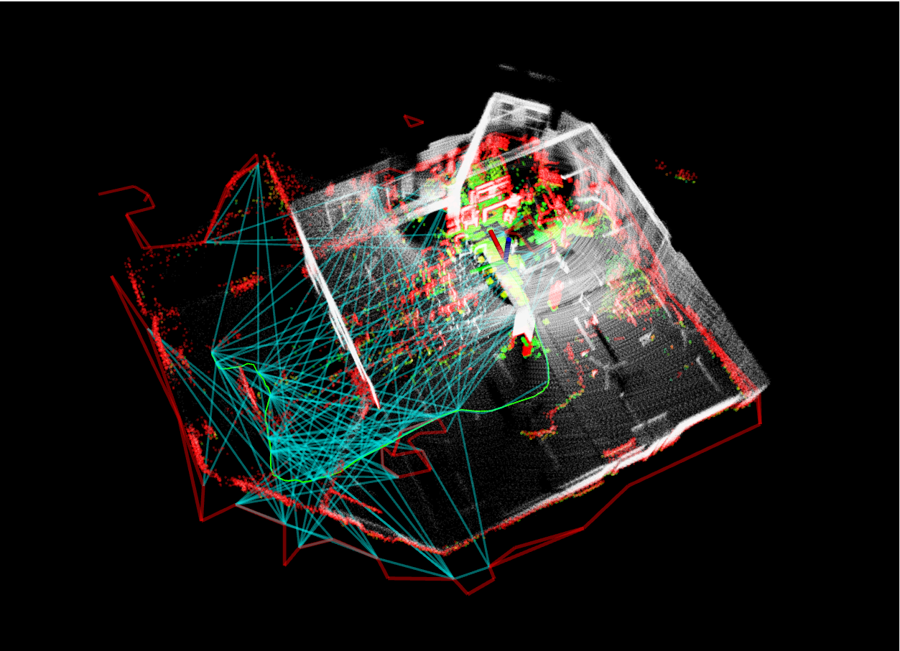
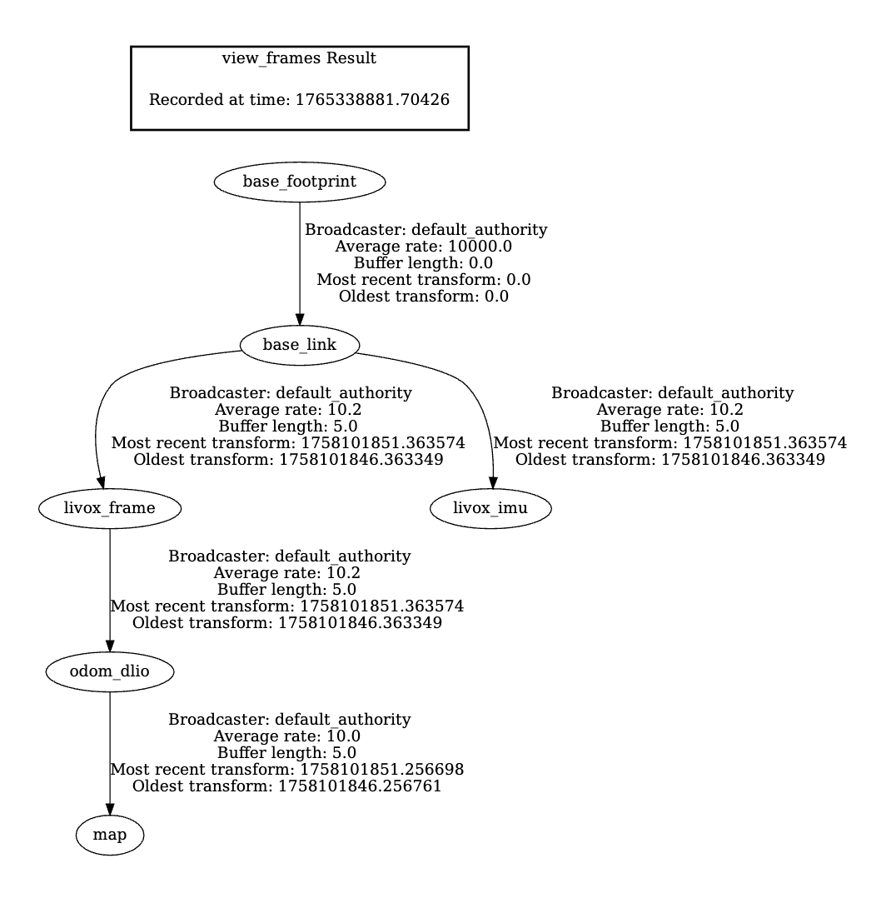
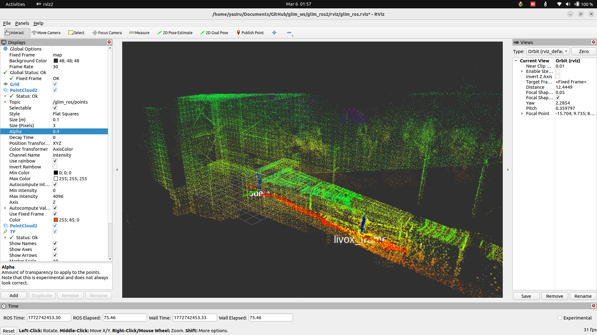
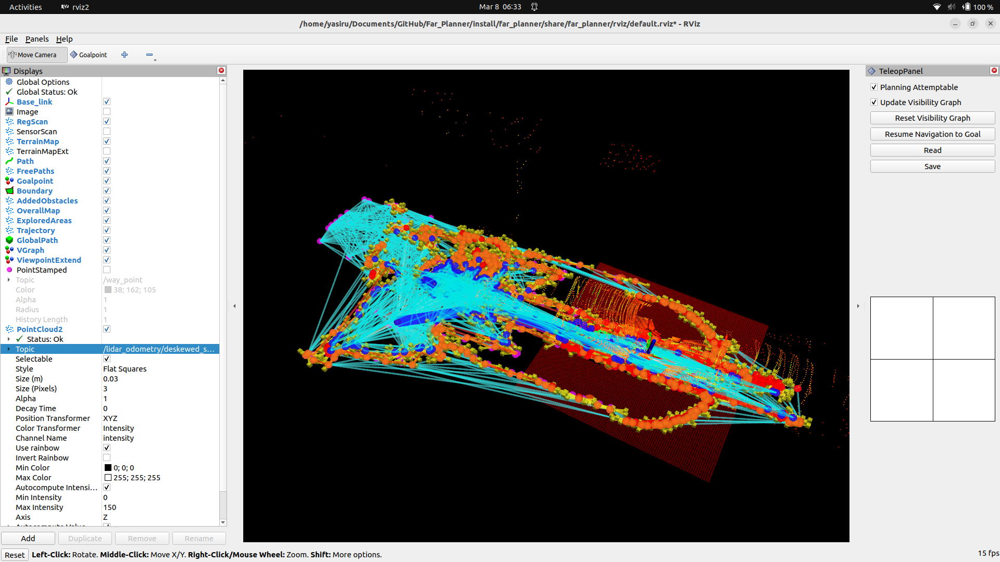
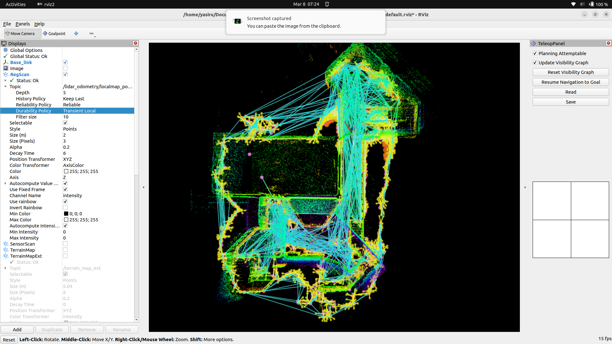
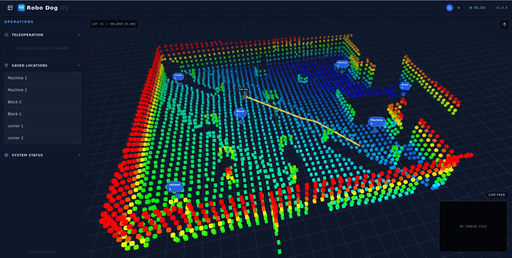
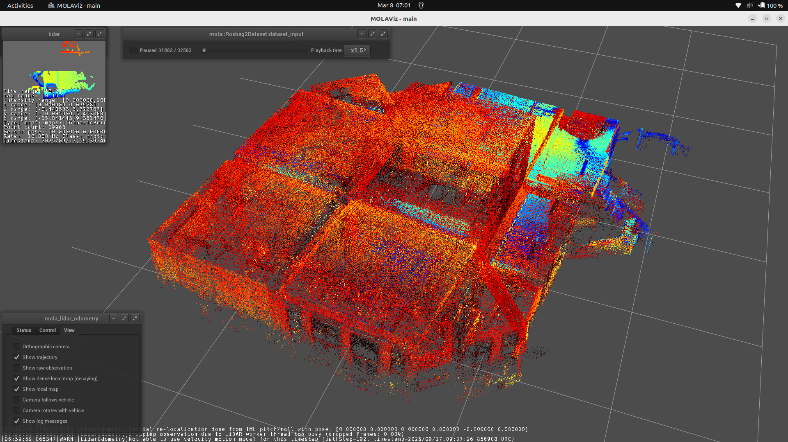

<p align="center">
  
</p>

<h1 align="center">Go2 Planner Suite</h1>

<p align="center">
  <strong>CUDA-Accelerated Autonomous Navigation for Unitree Go2 Quadruped Robot</strong>
</p>

<p align="center">
  <a href="#features">Features</a> •
  <a href="#architecture">Architecture</a> •
  <a href="#quick-start">Quick Start</a> •
  <a href="#cuda-acceleration">CUDA Acceleration</a> •
  <a href="#faq">FAQ</a>
</p>

---

## Overview

This repository contains a complete autonomous navigation stack for the **Unitree Go2** quadruped robot, featuring:

- **MOLA LO** - Modular Optimization Framework for LiDAR Odometry and mapping
- **Terrain Analysis** - Real-time traversability assessment
- **Far Planner** - GPU-accelerated visibility graph planning
- **Local Planner** - Reactive obstacle avoidance

---

## Architecture

<p align="center">
  
</p>

### Data Flow

```
LiDAR + IMU  ──►  MOLA LO  ──►  Terrain Analysis  ──►  Far Planner  ──►  Local Planner  ──►  Go2 Robot
                     │                   │
             /lidar_odometry        /terrain_map
                                         │
                                  Terrain Analysis Ext
                                         │
                                  /terrain_map_ext
```

### Key Topics

| Topic | Source | Description |
|-------|--------|-------------|
| `/lidar_odometry/pose` | MOLA LO | LiDAR-inertial odometry and state estimation |
| `/lidar_odometry/deskewed_scan_points` | MOLA LO | Registered point cloud |
| `/terrain_map` | Terrain Analysis | Local traversability (near-field) |
| `/terrain_map_ext` | Terrain Analysis Ext | Extended traversability (far-field) |

### TF Tree

<p align="center">
  
</p>

---

## Features

| Component | Description | Acceleration |
|-----------|-------------|--------------|
| **MOLA LO** | LiDAR Odometry and Mapping | Standard |
| **Far Planner** | Global path planning | CUDA (Visibility Graph) |
| **Boundary Handler** | Obstacle boundary processing | CUDA |
| **Terrain Analysis** | Local traversability (4m radius) | CPU + OpenMP |
| **Terrain Analysis Ext** | Extended traversability (40m radius) | CPU + OpenMP |
| **Local Planner** | Reactive navigation | CPU |

---

## Terrain Analysis Tuning

The terrain analysis nodes require tuning based on your robot's physical dimensions.

### Robot Parameters

| Parameter | terrain_analysis | terrain_analysis_ext | Description |
|-----------|------------------|---------------------|-------------|
| `vehicleHeight` | 0.4 | 0.4 | Robot height (m) - obstacles within this height are marked |
| `minRelZ` / `lowerBoundZ` | -0.5 | -0.5 | Min Z below base_link to consider |
| `maxRelZ` / `upperBoundZ` | 1.0 | 1.0 | Max Z above base_link to consider |
| `terrainUnderVehicle` | N/A | -0.1 | Assumed ground level when no data (base_link on floor = small negative) |
| `terrainConnThre` | N/A | 0.3 | Max elevation change for connected terrain |

### Tuning for Different Robots

**For a robot with base_link on the floor:**
```xml
<!-- terrain_analysis.launch -->
<param name="vehicleHeight" value="YOUR_ROBOT_HEIGHT" />
<param name="minRelZ" value="-0.5" />  <!-- Captures slight slopes -->

<!-- terrain_analysis_ext.launch -->
<param name="terrainUnderVehicle" value="-0.1" />  <!-- Small margin below floor -->
```

**For a robot with base_link elevated (e.g., at center of mass):**
```xml
<!-- terrain_analysis.launch -->
<param name="vehicleHeight" value="YOUR_ROBOT_HEIGHT" />
<param name="minRelZ" value="-BASE_LINK_HEIGHT - 0.5" />  <!-- Goes below ground level -->

<!-- terrain_analysis_ext.launch -->
<param name="terrainUnderVehicle" value="-BASE_LINK_HEIGHT - 0.1" />
```

### Slope Analysis

Slope is the nature of the slope.

<p align="center">
  
</p>

<p align="center">
  
</p>

---

## Visualization

### Simulation Environment

<p align="center">
  
</p>

### Visibility Graph (CUDA-Accelerated)

<p align="center">
  
</p>

The cyan lines show the **visibility graph** - navigation nodes that can "see" each other without obstacles. This computation is **GPU-accelerated** for real-time performance.

---

## Mission Planning UI

A modern, web-based interface is provided for high-level mission control and telemetry visualization.

<p align="center">
  
</p>

### Frontend Features
- **Interactive Map**: Point-and-click interface to set navigation goals on the global map.
- **Waypoint Management**: specific locations can be saved, named, and recalled from a persistent list.
- **Live Video Feed**: Low-latency video streaming from the robot's camera.
- **Teleoperation**: Virtual joystick for manual control overrides.

### Backend Architecture
The backend uses **FastAPI** to bridge ROS2 topics with the web frontend via WebSockets.

- **Technology**: Python (FastAPI, Uvicorn), AsyncIO.
- **Real-time Data**:
  - `/ws/points` &rarr; Stream of voxelized point clouds.
  - `/ws/tf` &rarr; Robot pose and map transforms.
  - `/ws/video` &rarr; JPEG-encoded camera stream.
- **Persistence**: `waypoints.json` stores user-defined locations.

---

## Voxelized Point Cloud

To ensure smooth performance on the web interface, the high-density SLAM point cloud is downsampled before transmission.

### Overview
- **Node**: `voxel_grid_node` (C++)
- **Function**: Applies a PCL VoxelGrid filter to reduce point count (~10x reduction) while preserving structural features.
- **Topic Flow**:
  - Input: `/dlio/map_node/map` (High density from SLAM)
  - Output: `/registered_scan_o3d/voxelized` (Optimized for Web UI)
- **Configuration**:
  - `voxel_size`: Default `0.1m` (balances bandwidth vs. detail).

---

## Quick Start

### Prerequisites

- **ROS2 Humble**
- **CUDA 11.0+** (for GPU acceleration)
- **Unitree Go2 SDK** (for real robot)

### Installation

```bash
# Clone the repository
git clone https://github.com/Quadruped-dyn-insp/Go2_planner_suite.git
cd Go2_planner_suite

# Build all workspaces
./scripts/build.sh
```

### Map Creation

<p align="center">
  
</p>

```bash
MOLA_USE_FIXED_LIDAR_POSE=true \
MOLA_USE_FIXED_IMU_POSE=true \
MOLA_GENERATE_SIMPLEMAP=true \
MOLA_SIMPLEMAP_OUTPUT="myMap.simplemap" \
MOLA_SIMPLEMAP_MIN_XYZ=0.2 \
MOLA_LO_INITIAL_LOCALIZATION_METHOD="InitLocalization::PitchAndRollFromIMU" \
MOLA_DESKEW_METHOD="MotionCompensationMethod::IMU" \
MOLA_IMU_TOPIC="/livox/imu" \
MOLA_LIDAR_TOPIC="/livox/lidar" \
MOLA_TF_BASE_LINK="Head_upper" \
mola-lo-gui-rosbag2 /home/yasiru/Documents/rosbags/rosbag_004

sm2mm -i myMap.simplemap -o myMap.mm -p sm2mm_no_decim_imu_mls_keyframe_map.yaml

mm-viewer myMap.mm  -l libmola_metric_maps.so

MOLA_GENERATE_SIMPLEMAP=true \
MOLA_SIMPLEMAP_OUTPUT="myMap.simplemap" \
MOLA_SIMPLEMAP_MIN_XYZ=0.2 \
MOLA_LO_INITIAL_LOCALIZATION_METHOD="InitLocalization::PitchAndRollFromIMU" \
MOLA_DESKEW_METHOD=MotionCompensationMethod::IMU \
MOLA_IMU_TOPIC="/livox/imu" \
MOLA_LIDAR_TOPIC="/livox/lidar" \
MOLA_TF_BASE_LINK="base_link" \
mola-lo-gui-rosbag2 \
  /home/yasiru/Documents/Far_planner_test/rosbag2_2026_03_03-14_46_17
```

### Re-localization

```bash
export MOLA_LO_PUBLISH_DESKEWED_SCANS=true
source install/setup.bash 
ros2 launch mola_lidar_odometry ros2-lidar-odometry.launch.py \
  start_active:=True \
  publish_localization_following_rep105:=False \
  start_mapping_enabled:=False \
  lidar_topic_name:="/livox/lidar" \
  imu_topic_name:="/livox/imu" \
  mola_tf_base_link:="base_link" \
  mola_deskew_method:="MotionCompensationMethod::IMU" \
  mola_initial_map_mm_file:=$(pwd)/myMap.mm

ros2 run tf2_ros static_transform_publisher 0 0 0 0 0 0 base_link livox_frame
```

### Others

```bash
ros2 bag play rosbag2_2026_03_03-15_06_01/ --loop

source install/setup.bash  && ros2 launch terrain_analysis terrain_analysis.launch 

source install/setup.bash  && ros2 launch terrain_analysis_ext terrain_analysis_ext.launch 

source install/setup.bash  && ros2 launch far_planner far_planner.launch.py
```

---

## CUDA Acceleration

### What's Accelerated?

#### 1. Far Planner - Visibility Graph

| Scenario | Nodes | Edges | CPU Time | GPU Time |
|----------|-------|-------|----------|----------|
| Small | 100 | 500 | 2.5 sec | 10 ms |
| Medium | 500 | 2000 | 4 min | 100 ms |
| Large | 1000 | 5000 | 42 min | 500 ms |

### Key CUDA Kernels

```cpp
// Far Planner - Visibility checking
__global__ void ComputeVisibilityConnections(...);
__device__ bool IsEdgeCollidePolygons_GPU(...);
__device__ bool doIntersect_GPU(...);
```

---

## Project Structure

```
Go2_planner_suite/
├── scripts/
│   ├── build.sh              # Build all workspaces
│   ├── setup.sh              # Environment setup
│   ├── launch.sh             # Launch real robot
│   └── sim.sh                # Launch simulation
├── config/                   # Global configuration
├── docs/
│   ├── images/               # Documentation images
│   └── setup/                # Setup guides
├── tools/                    # Utility scripts and debugging tools
└── workspaces/
    ├── autonomous_exploration/       # Mid-layer navigation framework
    │   ├── local_planner/           # Reactive obstacle avoidance
    │   ├── terrain_analysis/        # Local traversability mapping (near-field)
    │   ├── terrain_analysis_ext/    # Extended traversability mapping (far-field)
    │   └── go2_simulator/           # Gazebo simulation for Go2
    ├── mola_lidar_odometry/         # MOLA LO framework
    ├── far_planner/                 # CUDA-accelerated global planner
    │   ├── far_planner/             # Core visibility graph planner + CUDA
    │   └── boundary_handler/        # Obstacle boundary CUDA kernels
    └── pipeline_launcher/           # System orchestration & launch management
```

---

## FAQ

### General

<details>
<summary><b>Q: What robot is this designed for?</b></summary>

**A:** Unitree Go2 quadruped robot with a Livox Mid-360 LiDAR and built-in IMU. It can be adapted for other robots by modifying the URDF and sensor configurations.
</details>

<details>
<summary><b>Q: Can I run this without a GPU?</b></summary>

**A:** Yes, but with reduced performance. The CUDA kernels have CPU fallbacks, but expect 10-100x slower planning and odometry in complex environments.
</details>

<details>
<summary><b>Q: What's the minimum GPU requirement?</b></summary>

**A:** Any CUDA-capable GPU with compute capability 6.0+ (Pascal or newer). Recommended: GTX 1060 or better for real-time performance.
</details>

### Odometry and Localization

<details>
<summary><b>Q: Why is my RViz display blank?</b></summary>

**A:** Check these in order:
1. Verify `/state_estimation` is publishing: `ros2 topic hz /state_estimation`
2. Check TF tree is connected: `ros2 run tf2_tools view_frames`
3. Set RViz Fixed Frame to `map`
4. Ensure `/registered_scan` has data: `ros2 topic echo /registered_scan --once`
</details>

<details>
<summary><b>Q: MOLA LO is not receiving IMU data?</b></summary>

**A:** Check:
1. IMU topic name matches config (e.g. `MOLA_IMU_TOPIC`)
2. IMU data rate is sufficient (>100Hz recommended)
3. Timestamps are synchronized with LiDAR
</details>

### Planning

<details>
<summary><b>Q: The visibility graph has too many/few connections?</b></summary>

**A:** Adjust these parameters in Far Planner config:
- `nav_clear_dist`: Minimum clearance from obstacles (increase = fewer connections)
- `project_dist`: Maximum connection distance (decrease = fewer long connections)
</details>

<details>
<summary><b>Q: Path planning is slow even with GPU?</b></summary>

**A:** Check:
1. CUDA is actually being used: look for "CUDA available" in logs
2. Reduce number of navigation nodes if environment is too complex
3. Verify GPU isn't thermal throttling: `nvidia-smi`
</details>

<details>
<summary><b>Q: Robot doesn't follow the planned path?</b></summary>

**A:** The local planner may be overriding due to obstacles. Check:
1. `/terrain_map` shows correct obstacles
2. Local planner parameters aren't too aggressive
3. TF between `map` and `base_link` is accurate
</details>

### Simulation

<details>
<summary><b>Q: Gazebo crashes on startup?</b></summary>

**A:** Common fixes:
1. Install missing dependencies: `pip install lxml`
2. Kill zombie processes: `pkill -9 gzserver; pkill -9 gzclient`
3. Check GPU drivers: `nvidia-smi`
4. Reduce world complexity
</details>

<details>
<summary><b>Q: Robot falls through the ground in simulation?</b></summary>

**A:** Check:
1. Spawn height in launch file (should be ~0.275m for Go2)
2. Gazebo physics step size isn't too large
3. Contact sensor plugin is loaded
</details>

<details>
<summary><b>Q: Controller manager service not available?</b></summary>

**A:** The robot model didn't spawn correctly. Check:
1. `spawn_entity.py` completed without errors
2. URDF/Xacro files are valid
3. Gazebo plugins are installed
</details>

### Building and Dependencies

<details>
<summary><b>Q: CUDA compilation fails?</b></summary>

**A:** Ensure:
1. CUDA toolkit is installed: `nvcc --version`
2. Environment is set: `source /usr/local/cuda/bin/setup.sh`
3. CMake can find CUDA: check `CMAKE_CUDA_COMPILER`
4. GPU architecture matches: set `CMAKE_CUDA_ARCHITECTURES`
</details>

<details>
<summary><b>Q: Missing ROS2 packages?</b></summary>

**A:** Install common dependencies:

```bash
sudo apt install ros-humble-pcl-ros ros-humble-tf2-ros \
  ros-humble-nav-msgs ros-humble-geometry-msgs \
  ros-humble-gazebo-ros-pkgs
```
</details>

<details>
<summary><b>Q: Python module not found errors?</b></summary>

**A:** ROS2 Humble uses Python 3.10. If using conda:

```bash
conda deactivate  # Use system Python for ROS
# OR
pip install <package> --target=/opt/ros/humble/lib/python3.10/site-packages
```
</details>

---

## Configuration

### Key Parameters

| Parameter | File | Description |
|-----------|------|-------------|
| `sensor_frame` | DLIO config | LiDAR frame name |
| `nav_clear_dist` | Far Planner | Obstacle clearance |
| `terrain_resolution` | Terrain Analysis | Grid cell size |
| `local_planner_freq` | Local Planner | Control loop rate |

### Topic Remapping

```yaml
# Common remappings for real robot
/velodyne_points: /livox/lidar
/imu/data: /livox/imu
/odom: /odom_dlio
```

---

## Performance

### Benchmarks (RTX 3060, Intel i7-11800H)

| Module | Input Size | CPU Time | GPU Time |
|--------|------------|----------|----------|
| DLIO GICP | 10K points | 45 ms | 3 ms |
| Far Planner | 500 nodes | 240 sec | 0.1 sec |
| Terrain Analysis | 100K points | 15 ms | 15 ms* |

*Terrain analysis uses CPU+OpenMP (CUDA version planned)

---

## Contributing

1. Fork the repository
2. Create a feature branch: `git checkout -b feature/amazing-feature`
3. Commit changes: `git commit -m 'Add amazing feature'`
4. Push to branch: `git push origin feature/amazing-feature`
5. Open a Pull Request

---

## License

This project is licensed under the MIT License - see the [LICENSE](LICENSE) file for details.

---

## Acknowledgments

- [MOLA](https://github.com/MOLAorg/mola) - Modular Optimization Framework for LiDAR Odometry
- [FAR Planner](https://github.com/MichaelFYang/far_planner) - Planning algorithms
- [Unitree Robotics](https://www.unitree.com/) - Go2 robot platform

---

<p align="center">
  <sub>Built for autonomous quadruped navigation</sub>
</p>
